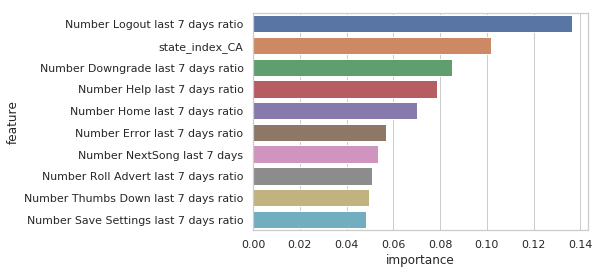

# Predicting customer churn using PySpark
## Description
In this product I will be making use of PySpark to predict customer churn for a fictitious music streaming service called Sparkify.  

## File Description

Churn Model.ipynb: A Jupyter notebook containing the Pyspark code that was used to do exploratory analysis and modelling on the user logs for Sparkify customers

## Dataset

The dataset is a json file containing a user log with all datestamped user interactions on the Sparkify platform. Some of the events that are captured are as follows:

* NextSong                 
* Home                     
* Thumbs Up                
* Add to Playlist          
* Add Friend               
* Roll Advert              
* Submit downgrade                   
* Cancel                   
* Thumbs Down              

There are 3 different sizes of the dataset available:

mini_sparkify_event_data.json: the smallest instance of the dataset (125 mb)
medium-sparkify-event-data.json: a medium-sized instance of the dataset (237 mb)
sparkify_event_data.json: the full dataset (12 gb)

I made use of the medium-sized dataset and made use of IBM Watson studio to explore the data and build a churn modelling

Data download links

* Link to small-sized subset of Sparkify data (125 mb): s3n://udacity-dsnd/sparkify/mini_sparkify_event_data.json
* Link to medium-sized subset of Sparkify data (237 mb):  https://s3.amazonaws.com/video.udacity-data.com/topher/2018/December/5c1d6681_medium-sparkify-event-data/medium-sparkify-event-data.json
* Link to full Sparkify dataset on AWS (12 gb): s3n://udacity-dsnd/sparkify/sparkify_event_data.json

## Instructions

Dependencies
For my analysis I made use of the following configuration and dependencies:

* Spark 2.3
* Python 3.5.0
* pandas 0.22.0
* plotly 3.6.1
* matplotlib 2.2.3
* seaborn 0.9.0

User installation
Clone the github repository and install all the dependencies.

`git clone git@github.com:Rmostert/Sparkify-churn.git`

## Motivation

This project is my Capstone project that I did for my Data Science Nanodegree I did through Udacity. The objective is to illustrate the use of Big data technologies and cloud services in the exploration, manipulation and modelling of big datasets.

## Summary of Results

I considered the following models when deciding on the best model to predict customer churn:

* Random Forest
* Linear Support vector machine
* Gradient Boosting tree

Below are some metrics for the 3 models:

  

The Gradient Boosting tree performed the best based on the F-measure. Here are some of the metrics for the final model after performing grid search:

|Measure                  |Value  |
|-------------------------|-------|
|Area under the PR curve  |0.89   |
|Accuracy                 |0.81   |
|Precision                |0.69   |
|Recall                   |0.76   |
|F statistic              |0.70   |

And the most important features:

  

## Acknowledgements and Licensing

Please see the LICENCE .txt file
